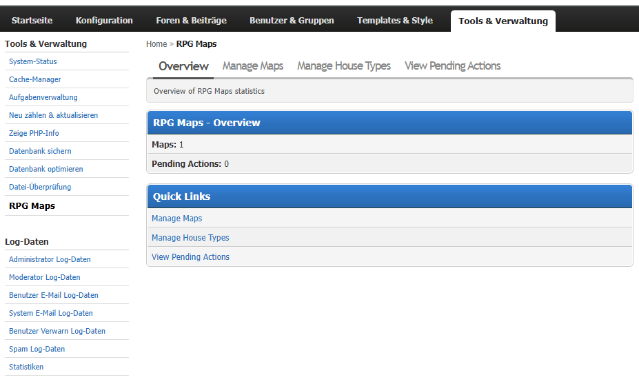
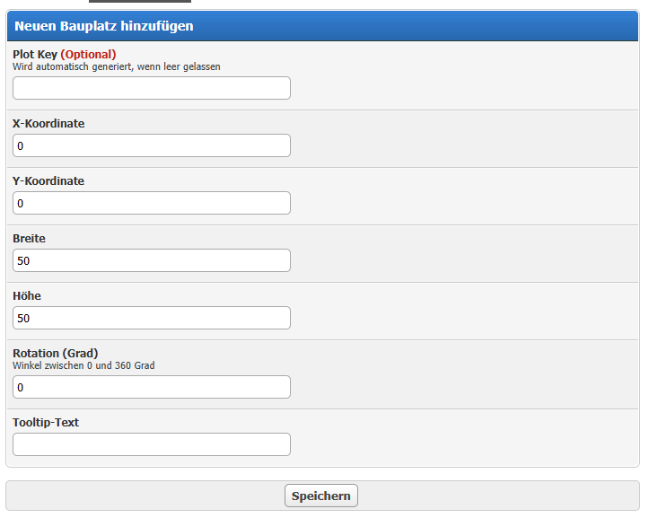
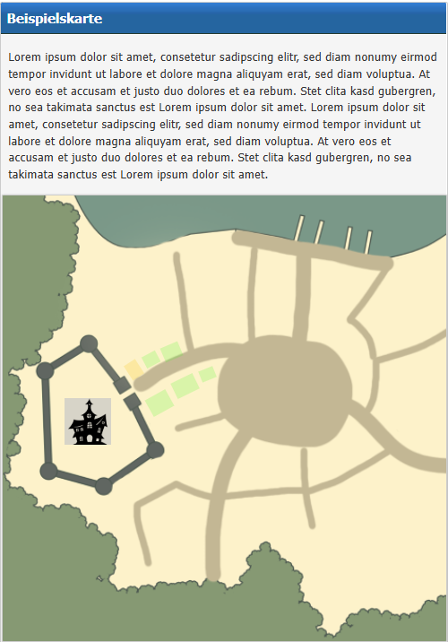

# RPG Maps – Interactive Map Plugin for MyBB 1.8

A MyBB 1.8 plugin that lets forum admins create interactive image-based maps with named, clickable plot overlays. Users can view maps, click on plots to see details, and admins manage everything via the ACP.

## Requirements

- MyBB 1.8.x
- PHP 7.4 or higher
- MySQL 5.7+ or MariaDB 10.4+
- No dependencies on other plugins

## Installation

1. **Upload files**
   - Copy all plugin files into your MyBB root directory, preserving the folder structure

2. **Activate the plugin**
   - Go to **Admin CP → Configuration → Plugins**
   - Find *RPG Maps* and click **Activate**
   - The plugin creates all necessary database tables automatically

3. **Configure settings**
   - Go to **Admin CP → Configuration → Settings → RPG Maps**
   - Adjust settings as needed (see [Configuration](#configuration))

4. **Create your first map**
   - Go to **Admin CP → Tools → RPG Maps**
   - Click **Add Map**, enter a title and upload a map image
   - Add plots to the map by clicking **Manage Plots**

## Configuration

All settings are found under **Admin CP → Configuration → Settings → RPG Maps**.

| Setting | Description | Default |
|---------|-------------|---------|
| `rpgmaps_enabled` | Master switch – enable or disable the plugin globally | On |
| `rpgmaps_max_upload_size` | Maximum allowed image upload size in KB | 512 |
| `rpgmaps_max_plot_size` | Maximum plot overlay size in pixels | 200 |
| `rpgmaps_allowed_extensions` | Comma-separated list of allowed image file types | png,jpg,jpeg,gif |

## Screenshots

## Uninstallation

1. Go to **Admin CP → Configuration → Plugins**
2. Click **Deactivate** next to *RPG Maps*
3. Click **Uninstall** – this removes all database tables and settings created by the plugin
4. Delete the plugin files from your server:
   - `rpgmaps.php` (root)
   - `inc/plugins/rpgmaps.php`
   - `inc/plugins/rpgmaps/` (entire folder)
   - `admin/modules/tools/rpgmaps.php`
   - `inc/languages/english/rpgmaps.lang.php`
   - `inc/languages/deutsch_du/rpgmaps.lang.php`

## Changelog

See [CHANGELOG.md](CHANGELOG.md) for the full version history.
